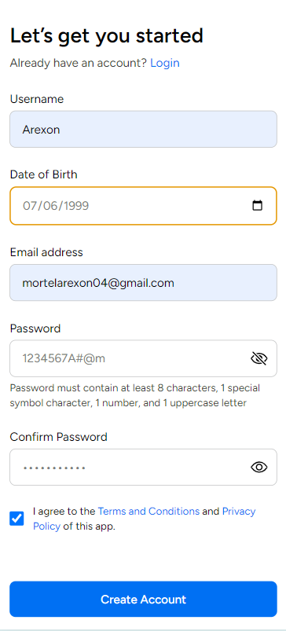

# Create Account Form UI Design

## Description
This project implements a Create Account form using React and Tailwind CSS. The form includes input fields for username, email, date of birth, password, confirm password, and a checkbox for agreeing to terms and conditions.

## Features
- Responsive design for various screen sizes
- Form validation for username length, date of birth, email format, and password complexity
- Password toggle feature to show/hide password
- Submit button disabled when form inputs are invalid
- Link to login page
- Links to terms of conditions and privacy policy

## Technologies Used
- React
- Tailwind CSS

## Usage
1. Clone the repository: `git clone <repository-url>`
2. Install dependencies: `npm install`
3. Start the development server: `npm run dev`

## Credits
This project was created by Arexon Mortel as part of coding test. 

